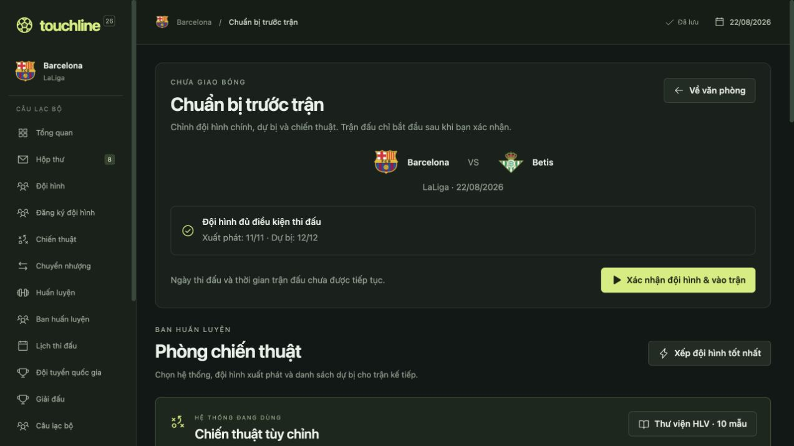
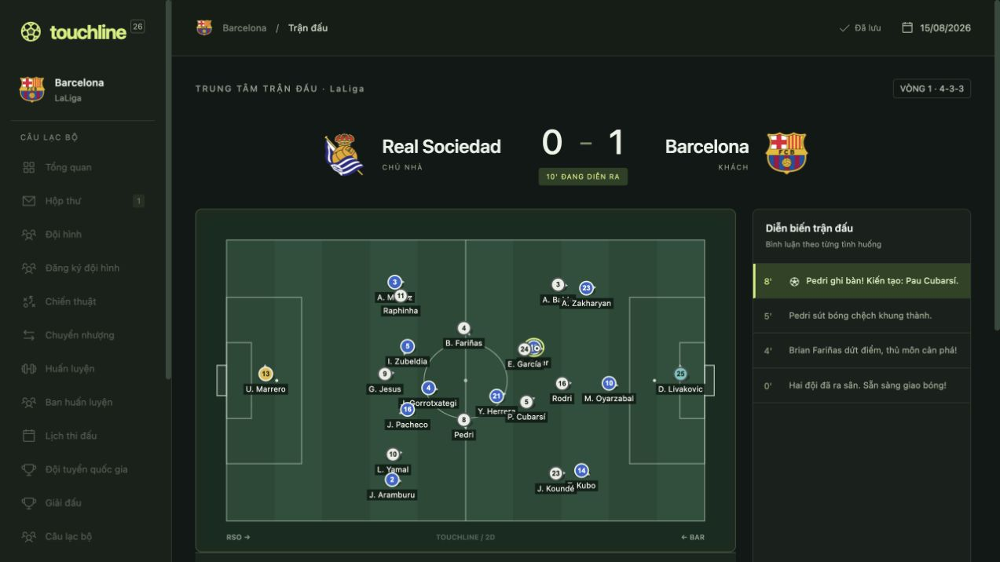
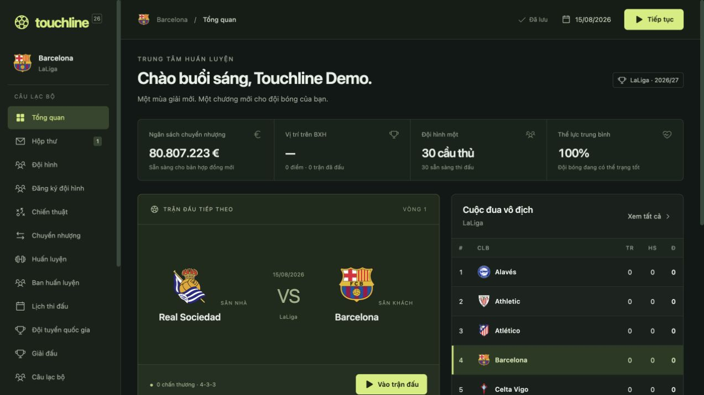
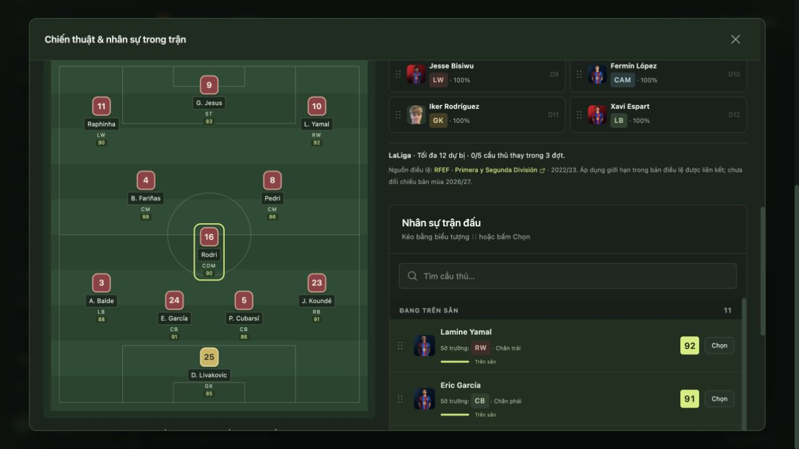
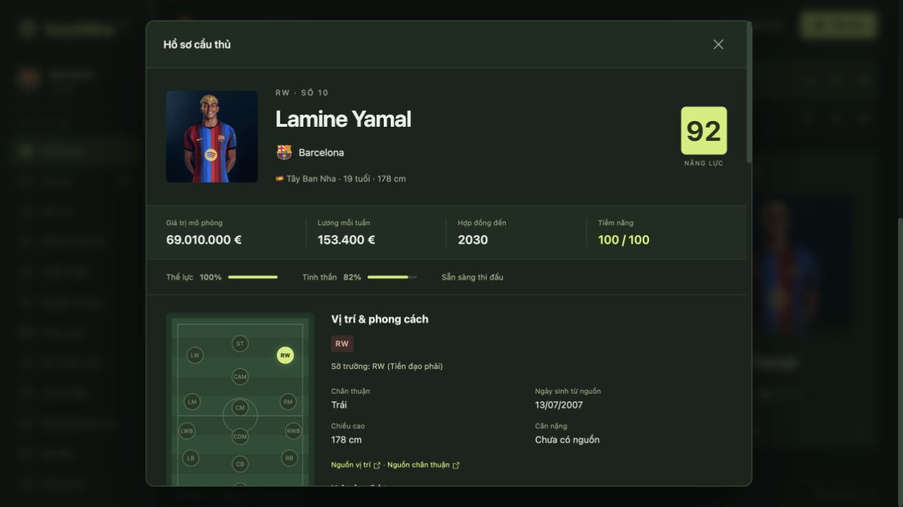
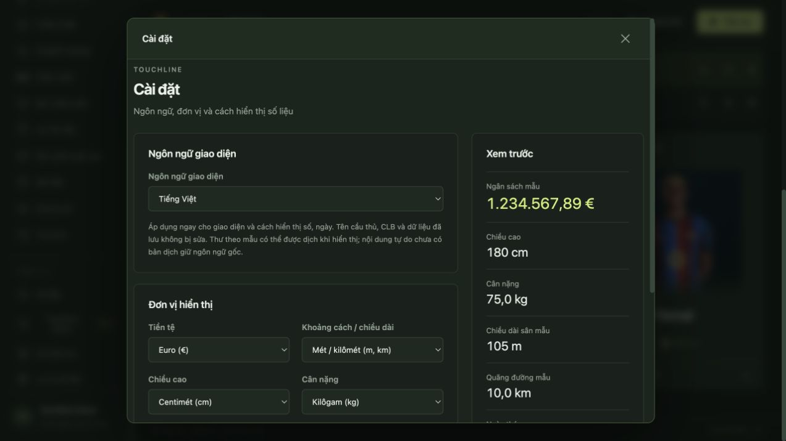

# Touchline — ảnh chụp trong game / screenshots

Chụp trực tiếp ngày 03/10/2026 từ một sự nghiệp demo Barcelona riêng. Đây là giao diện thật, không phải ảnh dựng quảng cáo. Đội hình và số liệu trong ảnh phản ánh bản demo; chỉ số, tài chính và diễn biến là mô phỏng, không phải thông tin xác nhận ngoài đời.

Ảnh cầu thủ và logo xuất hiện trong giao diện thuộc chủ sở hữu tương ứng. Các lưu ý về mục đích giải trí và tài sản bên thứ ba trong [README](../README.md) cũng áp dụng cho bộ ảnh này.

## Chuẩn bị trước trận / Pre-match preparation — 1.7.1

## Trận đấu 2D / 2D match — 1.7.1

## Tổng quan câu lạc bộ / Club overview

## Chiến thuật và nhân sự trong trận / In-match tactics and squad

## Hồ sơ cầu thủ / Player profile

## Ngôn ngữ và đơn vị / Language and units

Tải ảnh JPEG gốc trong [thư mục screenshots](screenshots). Bài đăng mẫu tiếng Việt: [COMMUNITY_POST.vi.md](COMMUNITY_POST.vi.md).
